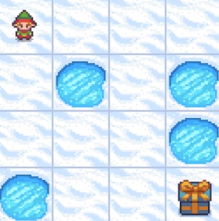
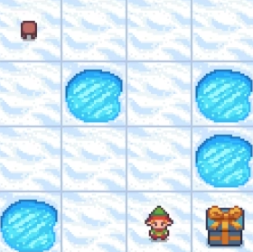
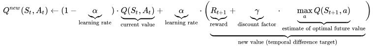

# 1. Frozen Lake

### Introduction

The main goal in "Frozen Lake" requires the agent to tranverse the frozen lake from the start to the goal without falling into any of the holes.

<b><u>Start</u></b>
  
</img>

<b><u>Goal</u></b>
  
</img>

# 2. Method

### Reinforcement learning

There are 3 usual considerations in reinforcement learning: agent, state, a set of action per state. Given a state, an agent performs an action available in the state and is subsequently presented with a reward/penalty. The goal of reinfocement learning is to maximize the total reward.

### Q-learning

Q-learning is a reinforcement learning algorithm that is suitable for finite Markov Decision Process (MDP) and it does not require a model of the environment (a.k.a model-free).
 
<i>**Finite MDP refers a specific type of MDP where state space, action space and reward functions are all finite.</i>
  
</img>
  

Let's explore Q-learning algorithm with an example. At step T, in state ST, an agent would be present with a set of actions (each with their respective Q value). When the agent performs an action AT, a reward RT+1 is given, and the agent enters a new state ST+1. In Q-learning algorithm, it involves updating the Q value of the action AT in ST with the consideration of temporal difference between the current Q value and the estimated Q value.

Intuitively, it measure the before and after effect of taking an action. Coupled with a learning rate, it takes a portion of the learning (positive/negative) experience and update the current Q value.

# 3. Result

<video src="./asset/video.mp4"></video>
